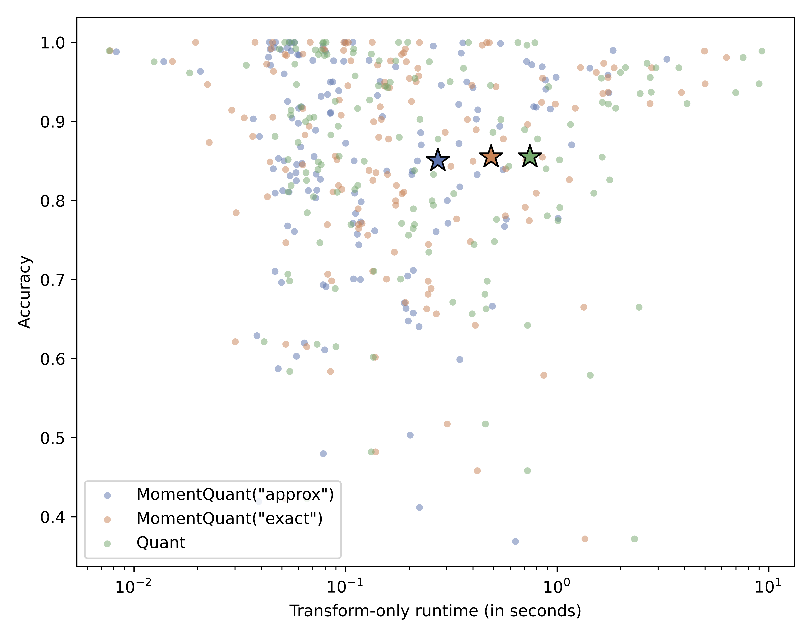

# MomentQuant: an even more minimalist interval method with linear time complexity for time series classification

This repository accompanies the following paper:

> Johann Faouzi. *MomentQuant: an even more minimalist interval method with linear time complexity for time series classification*. 2026. https://arxiv.org/abs/2609.05136


## Presentation

For time series classification, this repository provides two main contributions:
* a faster, exact implementation of Quant ([Publication](https://link.springer.com/article/10.1007/s10618-024-01036-9), [Original code](https://github.com/angus924/quant), [aeon's documentation](https://www.aeon-toolkit.org/en/stable/api_reference/auto_generated/aeon.transformations.collection.interval_based.QUANTTransformer.html)), and
* an even faster, approximate implementation of Quant that we call **MomentQuant**: quantiles are approximated using moments thanks to the [Cornish-Fisher expansion](https://en.wikipedia.org/wiki/Cornish–Fisher_expansion).

On the 142 UCR data sets, the transformation step of MomentQuant is nearly 3 times faster (38.74s with 1 thread, 23.36s with 8 threads) than the original Quant implementation (105.55s with 1 thread, 65.63s with 8 threads).
This approximation comes at a small cost in classification performance (mean accuracy: 0.8505 vs 0.8551, delta = -0.0046).



## Dependencies

All the experiments were run on a machine with Python 3.13.14 and the following dependencies:
* aeon: 1.5.0
* joblib: 1.5.3
* matplotlib: 3.11.1
* numba: 0.63.1
* numpy: 2.3.5
* pandas: 2.3.3
* scipy: 1.17.1
* seaborn: 0.13.2
* sklearn: 1.8.0
* torch: 2.13.0

These dependencies are listed in the `pyproject.toml` file and can be installed using `pip install .` at the root level of this repository.
**Using a virtual environment to run the experiments is strongly advised.**


## Experiments

To reproduce all the experiments, use the following command at the root of this repository:

```bash
./run_pipeline.sh
```

On Windows, you need to use a terminal with Bash (e.g., Git Bash).
All the results will be saved in the `results` directory.
We provide our results in the `results` directory, so you can just rename the existing `results` directory if you want to save our results, otherwise the command will overwrite the existing files with your results.


## Credits

The `PythonResampleIndices` directory contains the resamples indices for every data set.
They were downloaded from a link available on this [webpage](https://tsml-eval.readthedocs.io/en/stable/publications/2023/tsc_bakeoff/tsc_bakeoff_2023.html) accompanying this publication: [Bake off redux: a review and experimental evaluation of recent time series classification algorithms](https://link.springer.com/article/10.1007/s10618-024-01022-1).
They have been copied into this repository to make sure that this repository is standalone, in case that the files would not be available anymore for whatever reason.
The credits for these resample indices should go to the corresponding authors: [Matthew Middlehurst](https://github.com/MatthewMiddlehurst), [Patrick Schäfer](https://github.com/patrickzib), and [Anthony Bagnall](https://github.com/TonyBagnall).


## Citation

If you use MomentQuant in a scientific publication, the following citation in your publication would be appreciated:

> Johann Faouzi. *MomentQuant: an even more minimalist interval method with linear time complexity for time series classification*. 2026. https://arxiv.org/abs/2609.05136

This citation will be updated when the paper is a published in a peer-reviewed journal or conference.
